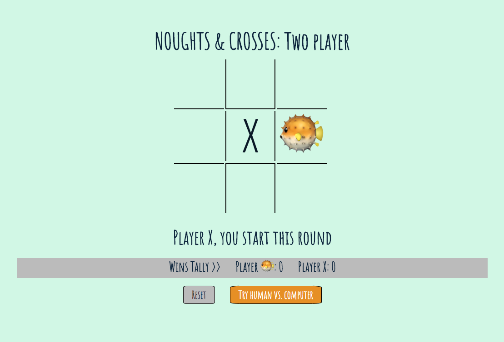

# Noughts & Crosses: Xs vs. Blowfish &#128033;
Simple online game of Noughts & Crosses, either [two player](https://katshaze.github.io/project0) or [human vs. (not very skilled) computer](https://katshaze.github.io/project0-AI).

## Get it running:
* Simply open it in your browser: [Two player](https://katshaze.github.io/project0) / [Human vs. computer](https://katshaze.github.io/project0-AI)
* Tested browsers so far include Chrome, Firefox & Safari

## Technologies used:
* JavaScript
* jQuery
* HTML & CSS
* Animate.css
* Babel (for transpiling)

## Game features include:
* Unexplained blowfish in place of Os who puffs up for a win &#128033;
* Alternating starting player
* Winner of each game displayed on screen (inc. with animations)
* Wins tallied (until a screen refresh)
* Reset button plus click anywhere reset function each time a game ends
* Choice of playing two player or against the computer (easy) (the two versions are separate web pages with a button linking them)

## Problematic bits
* Winning combinations are a bit hardcoded; not very efficient for scaling into a larger board.
* Updates to style & functionality involve updating both versions since they've been separated, causing extra work

## Code approach and structure
* The approach was to separate the javascript containing the game logic and 'state of play', from the javascript interacting with the DOM and rendering the state of play onscreen following refresh.
* This approach was maintained when modifying the code to create the human vs. computer version.

## TODOs
- [ ] Players to be able to choose their icons
- [ ] Combine two player and AI version into single webpage
- [ ] Maaaaaybe have a crack at creating an AI (hard) version for the human vs. computer mode
- [ ] Expand to a 4x4 board for a 'Connect Four'-style game

## Licensing
Licensed under MIT.

## Thanks to

Joel Turnbull, the WDi26 instruction team (John and Theo), and my classmates, for help with approach and debugging.
